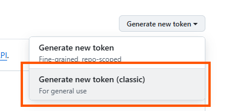
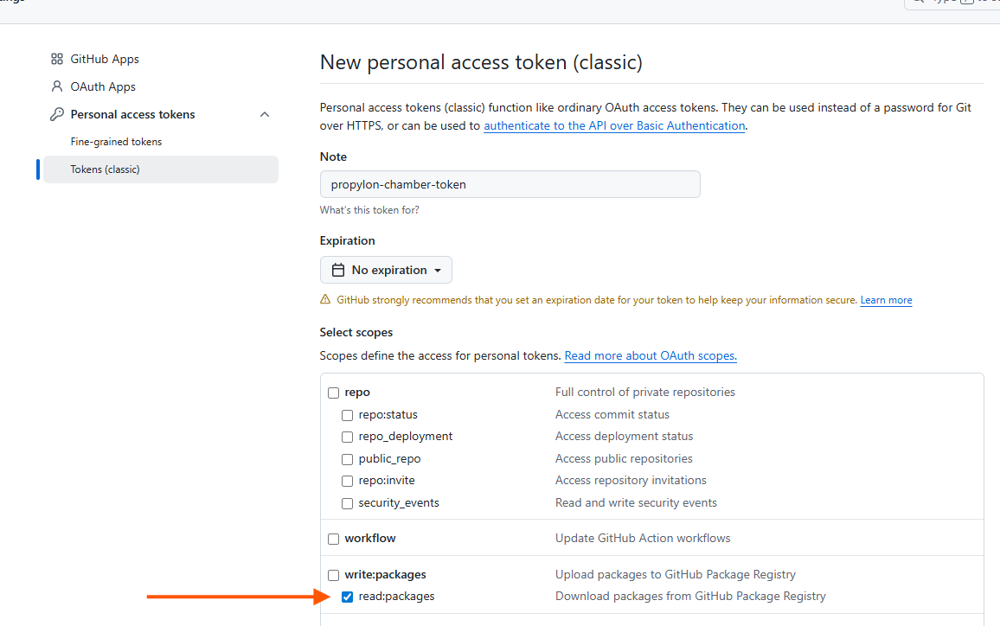

To set up your npm configuration, generate a `.npmrc` file based on the provided `.npmrc.example`:

```sh
cp .npmrc.example .npmrc
```

Replace `NPMRC_NODE_AUTH_TOKEN` value in `.npmrc` with your authentication tokens:

- 1. Visit [Github tokens page](https://github.com/settings/tokens)
- 2. Create a clasic toke
- 3. Create your 'read:packages' token

 <p align="center">
  
</p>
  <p align="center">
  
</p>
